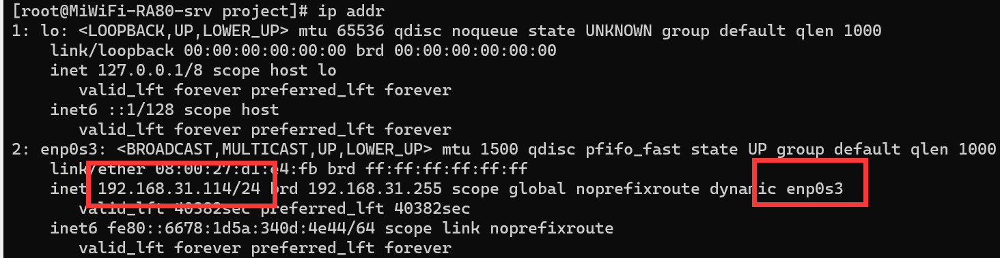

如何在vbox搭建linux开发服，下面以在vbox上安装centos7虚拟机为例子。

## 联网

默认安装的进入系统的虚拟机都是不能联网的，此时网卡连接方式为

原因是网卡没有激活，通过`ip addr`命令查看ip地址，

[ip命令]: https://wangchujiang.com/linux-command/c/ip.html

执行`ifup enp0s3` ，再`ping`即发现可以联网，此时最好改下网卡配置文件

ONBOOT=no 改成 ONBOOT=yes

退出保存，再重新激活下网卡，这样下次重启系统就能自动联网。如果只是要在虚拟机里联网，上述操作已经可以满足需求。

## 绑定静态ip

如果要在外面ping通虚拟机，需要虚拟机分配一个独立ip。此时需要把网络连接改成

此时可以看到

查看网关

查看dns

此时需要需要网卡文件

配置从前面的命令获得， 再执行 `systemctl restart network` 重启网络服务。

## 开放ssh连接

打开配置文件 `vi /etc/ssh/sshd_config`

1. 找到： #Port 22， 把#号去掉。如果没有#号，可以不管
2. 找到：#PermitRootLogin yes，把#号去掉。如果没有#号，可以不管
3. 找到：#PasswordAuthentication yes，把#号去掉。如果没有#号，可以不管

重启服务`systemctl restart sshd`

`ss -tln | grep 22`  

[ss命令]: https://wangchujiang.com/linux-command/c/ss.html

此时可以看到22端口已经开放

